# 📦 Retail Price Optimization Dashboard

---

## 📌 Project Summary

This dashboard provides actionable insights for **retail pricing strategy** using historical sales data.  
It analyzes **price elasticity**, **demand patterns**, and **discount impact** to help business teams set optimal prices that maximize revenue and protect margins.

---

## 🎯 Business Problem

Retailers often discount products without understanding how price affects demand or revenue.  
This results in lost profits or unsold inventory. The challenge is to use **data-driven pricing** to:

- Identify elastic and inelastic items  
- Forecast revenue based on price changes  
- Understand discount effectiveness  
- Simulate price scenarios before executing them

---

## 🔍 Key Features

- 🧮 Price Elasticity metrics by product  
- 💸 Revenue impact visualization for various price points  
- 📉 Discount vs sales uplift analysis  
- 📊 Demand segmentation (elastic vs inelastic)  
- 🔁 Interactive price simulations and filters

---

## 🛠 Tech Stack

- **Language:** Python  
- **Libraries:** `pandas`, `numpy`  
- **Data:** CSV sales dataset  
- **Visualization:** Power BI  
- **File Format:** `.pbix`

---

## 🧠 Architecture

```mermaid
flowchart TD
    subgraph KPIs
        KPI1["Price Elasticity by SKU"]
        KPI2["Revenue Uplift Projection"]
        KPI3["Impact of Discounts"]
        KPI4["Elastic vs Inelastic Items"]
        KPI5["Price Simulation Insights"]
    end

    SRC["📥 Excel / CSV Sales Data"] --> PY["🐍 Python Script"]
    PY --> PD["🧹 Pandas Cleaning"]
    PD --> DB["📊 Excel Table / Model"]
    DB --> BI["📈 Power BI Dashboard"]
    BI --> OUT["💡 Pricing Strategy Insights"]
    BI --> KPI1 & KPI2 & KPI3 & KPI4 & KPI5

```

## 📊 KPIs Tracked
Price Elasticity by Product

Revenue Forecast from Simulated Prices

Discount Impact on Sales

Elastic vs Inelastic Item Classification

Scenario-based Price Planning

## 📸 Dashboard Preview

## 🚧 Challenges & Learnings
Handling missing pricing data and extreme outliers

Modeling elasticity using simple linear regression

Creating dynamic “what-if” simulations in Power BI

Designing business-first visuals for non-technical users

## 🚀 Future Enhancements
Integrate real-time store pricing data

Add SKU-level promotional forecasting

Expand model to include competitor pricing

Deploy as web dashboard with user filters

## 👨‍💻 About Me
Hi, I'm B. Sunil Kumar Reddy, a Data Analyst who builds real-world dashboards from real-world data.
Focused on APIs, automation, and business value through analytics.

🔗 LinkedIn Profile(https://www.linkedin.com/in/sunilreddy-data-analyst/)

💻 Explore More Projects(https://github.com/Sunil5411)

## ⭐ Support
If you found this project helpful, feel free to give it a ⭐ — it motivates me to keep building and sharing more real-world analytics projects.
